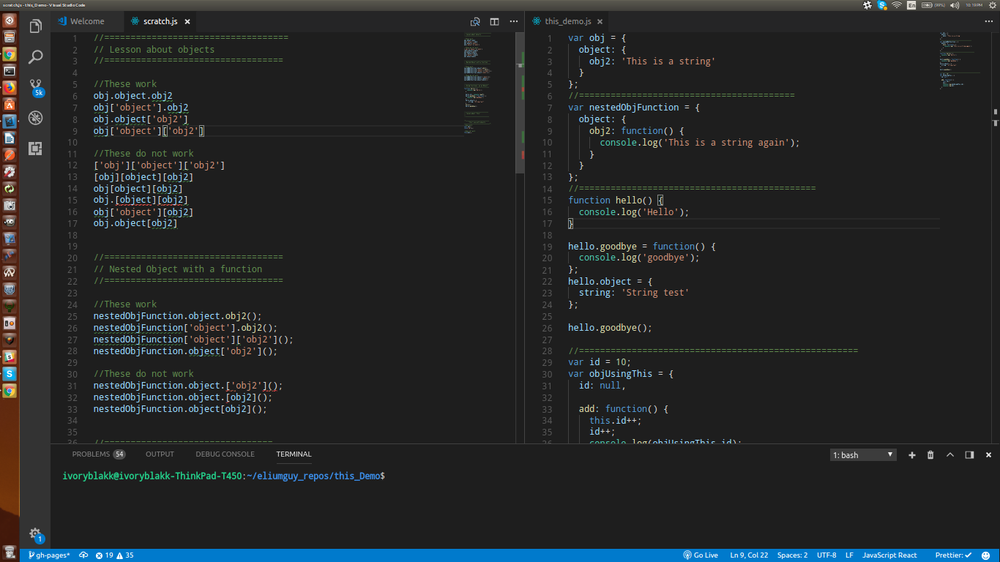

These two JS files accompany [this video about objects](https://www.youtube.com/watch?v=f-aKxXt8Y0A).  We recommend opening them both in side-by-side windows so you can reference both of them as you watch the video.  Like this:

___
___
### 